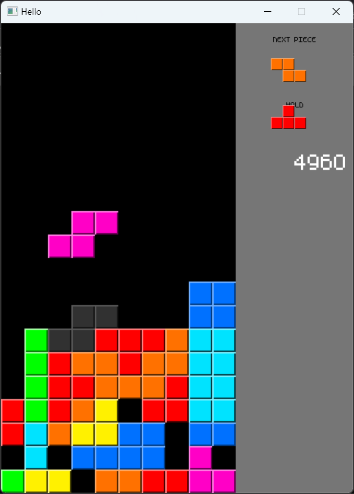

# JaiTetris
### A simple Tetris game written in Jai.

The game compiles on windows. You could probably pretty easily modify the source to make it compile on other platforms. I would've made it cross platform but I'm not super confident in my ability to do that and just wanted this to be a quick little project.

There is no home screen, game over, or level progression. There is a score displayed on the right. The purpose of this project is to get more comfortable with Jai so the game is not super polished, but it's definitely Tetris!

## Controls:
- AD to move left and right
- S to soft drop
- LShift to hard drop
- C to hold piece/switch to currently held piece

